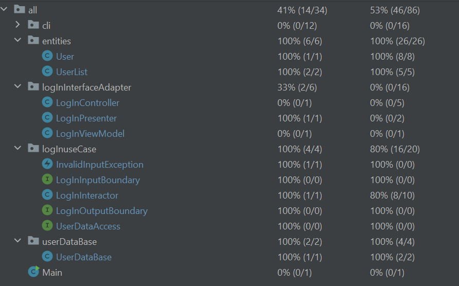

# Register/LogIn/ShowUsers/LogOut Use Case

 ## 1.Packaging

    I devided my Use case into 5 packages.
    
    Frameworks & Drivers (Blue)
    cli
    courseDataAccess
    
    **********************************************************************
    
    Interface Adapters (Green)
    LeaveReviewInterfaceAdapters

    **********************************************************************

    Application Business Rules (Red)
    LeaveReviewUseCase

    **********************************************************************

    Enterprise Business Rules (Yellow)
    entities
    

## 2.Javadoc and Testing
    
    Packages that were documented using JavaDoc:

    courseDataAccess
    LeaveReviewInterfaceAdapters
    LeaveReviewUseCase
    entities
    
    **********************************************************************
    Documenting cli was omittied, as it only uses Presenter and Controller
    classes from interfaceAdapters package.

    **********************************************************************
    Tests are provided for every class and method except for the cli
    package, as testing it would be unconvinient, because the only function
    of this package is to display output and accept input from the user.

    **********************************************************************
    Unfortunately, I didn't figure out how to generate the test report, but
    all tests are runnable, and can be run by running NameOfClassTest.java.
    

## 3. CLI

    The following diagram explains how the CLI works.

    **********************************************************************

    I would also like to note that I made CLI the way it is open for 
    extention. For instance, and infinte amount of other options can
    be added to MainMenu, by just adding one more if statement and
    making a call of other interface that will lead user further.

